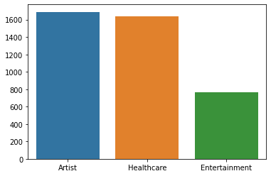
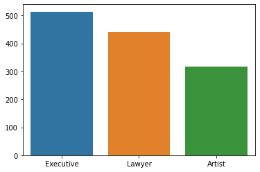

# Clustering-Automobile-Customers

## Bussiness Scenario
We are a car company and we are bringing 5 new vehicles to the market this year. We have a dataset of ~10,000 customers who indicate interest in purchasing a new car this year from us. We will use a clustering algoritmn to segment our customers into 5 groups each group will be targeted with ads for the vehicle that best fits their group. 

The Vehicle descriptions...
1. Compact SUV
2. Crossover (Station Wagon)
3. 2 Seater Sports Car
4. 4 Door Sedan
5. Pickup Truck

## EDA Conclusions
1. Spending Scores tend to increase as age increases. Almost all customers with 'low' spending scores are under 50, and the distribution really dips off after 40.

2. We can reject the null hypothesis that married and unmarried customers stay the same, it turns out that unmarried customers have lower spending scores on average. most likley because only one person will pay for the car.

3. Healthcare workers tend to spend the least, while lawers and executives tend to spend the most.

## Reccomendations
1. Avoid marketing more expensive vehicles to people under 35-40.
2. Prioritize advertising towards married people in general as they're likley to spend more.
3. Even without any clustering, we can infer that it's best that our Sedan be marketed to healthcare workers while the sport's car should be catered to execs and lawers. These findings also suggest that the pickup truck may not do well, but there is no evidence.

## Analysis of clusters
1. people in their 30's, predominatley working in the arts and entertainment space. We'll market the Station Wagon to them based primarly on their average spending score.
2. elderly and wealthy married people. We'll market the Sports Car to them because they spend the most on average and don't have to drive children around.
3. Young people with kids predominatley working in the healthcare & medical industry. We'll market the Sedan to them because it's the cheapest option.
4. people in their 40's, predominatley working in the arts and entertainment space. We'll market the Compact SUV to them based primarly on their average spending score.
5. People, about 60% men, in their 50's with artists and lawers being very popular professions. We'll market the Pickup Truck to them because they seem most likley to buy it. however they would probably be better suited for a Sports Car or Compact SUV.
